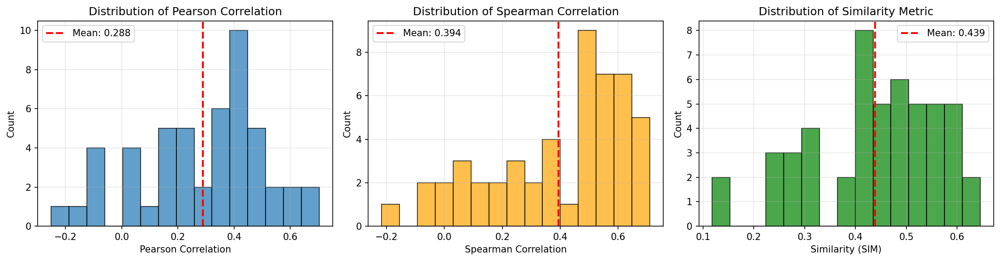
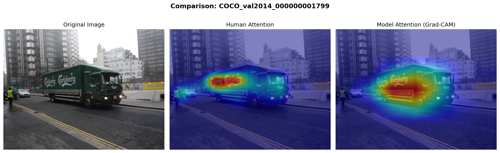
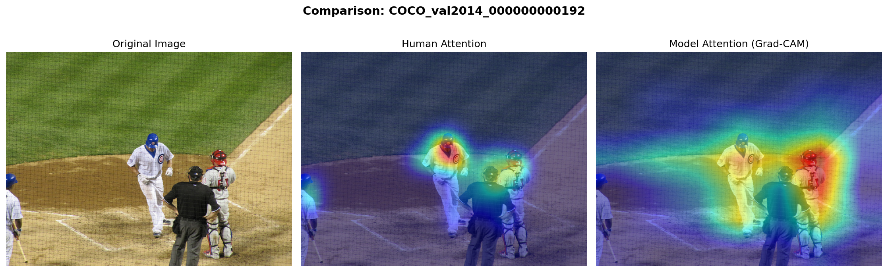
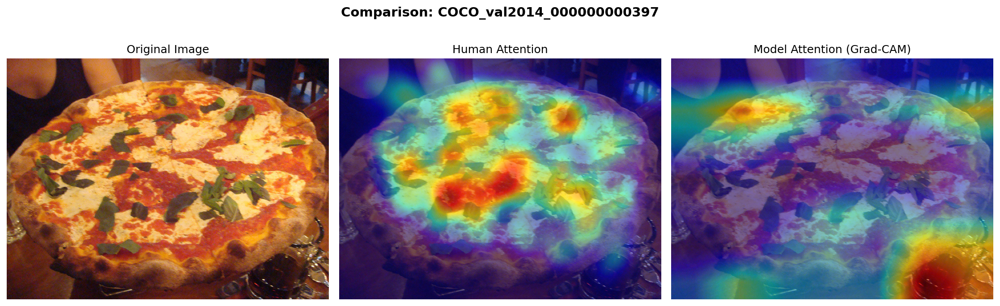

# Large-scale Receptive Field to Saliency Correlation Study

## Abstract

This project compares human visual attention patterns with deep neural network attention mechanisms. I use the SALICON dataset (Jiang et al., 2015) for human eye-tracking saliency maps and Gradient-weighted Class Activation Mapping (Grad-CAM) to extract attention from a pre-trained ResNet50 CNN. Our analysis of 50 images reveals moderate correlation (mean Pearson r=0.288) between human and model attention, with strong agreement on text-containing images and divergence on textured or multi-object scenes.

## Problem and Approach

**Problem:** Do deep learning models attend to images the same way humans do?

**Solution:** 
1. Load images and human saliency maps from SALICON dataset
2. Generate model attention using Grad-CAM on pre-trained ResNet50
3. Compute quantitative similarity metrics (Pearson correlation, Spearman correlation, similarity index)
4. Visualize and analyze patterns of agreement/disagreement

## Framework and Implementation

**Frameworks:**
- PyTorch 2.0+ (deep learning framework)
- pytorch-grad-cam library (Grad-CAM implementation)
- OpenCV, matplotlib (visualization)
- NumPy, SciPy, pandas (analysis)

**Code Base:**
- Pre-trained ResNet50 from PyTorch torchvision model zoo
- Grad-CAM implementation from pytorch-grad-cam library by Jacob Gildenblat
- Custom modules for dataset loading, metrics computation, and visualization

## Results

### Quantitative Summary

| Metric | Mean | Std Dev | Min | Max |
|--------|------|---------|-----|-----|
| Pearson Correlation | 0.288 | 0.226 | -0.251 | 0.702 |
| Spearman Correlation | 0.394 | 0.239 | -0.217 | 0.709 |
| Similarity (SIM) | 0.439 | 0.127 | 0.118 | 0.645 |

### Distribution of Metrics



### Example Comparisons

**High Agreement (Pearson r = 0.70)**  
Both human and model strongly attend to text/branding on the truck.



**Medium Agreement (Pearson r = 0.62)**  
Model detects multiple players; humans focus on main action figure.



**Low Agreement (Pearson r = -0.25)**  
Model attention diffuses across texture; humans focus on semantic center.



### Key Findings

- **High agreement (r>0.6):** Images with text/branding (8% of images)
- **Low agreement (r<0.2):** Textured or complex multi-object scenes (32% of images)
- **Pattern:** Model attention tends to be more diffuse; human attention more focused on semantic objects
- **Text advantage:** Both humans and CNNs strongly attend to readable text in images

## References

**Dataset:**  
Jiang, M., Huang, S., Duan, J., & Zhao, Q. (2015). SALICON: Saliency in Context. *CVPR 2015*.  
Dataset: http://salicon.net/challenge-2017/

**Grad-CAM:**  
Selvaraju, R. R., Cogswell, M., Das, A., Vedantam, R., Parikh, D., & Batra, D. (2017). Grad-CAM: Visual Explanations from Deep Networks via Gradient-based Localization. *ICCV 2017*.  
Implementation: https://github.com/jacobgil/pytorch-grad-cam

**Pre-trained Model:**  
He, K., Zhang, X., Ren, S., & Sun, J. (2016). Deep Residual Learning for Image Recognition. *CVPR 2016*.

**Metrics:**  
Bylinskii, Z., Judd, T., Oliva, A., Torralba, A., & Durand, F. (2018). What do different evaluation metrics tell us about saliency models? *TPAMI 2018*.

## Installation and Usage

### Prerequisites
- Python 3.8+
- CUDA-capable GPU (recommended) or CPU
- ~5GB disk space for dataset

### Setup Instructions

1. **Clone repository:**
```bash
git clone https://github.com/YOUR_USERNAME/CAP6415_F25_project-Saliency-Correlation-Study.git
cd CAP6415_F25_project-Saliency-Correlation-Study
```

2. **Install dependencies:**
```bash
pip install -r requirements.txt
```

3. **Download SALICON dataset:**
   - Visit: http://salicon.net/challenge-2017/
   - Download **"Images (3.0G)"**: [Direct Link](https://drive.google.com/uc?id=1g8j-hTT-51IG1UFwP0xTGhLdgIUCW5e5&export=download)
   - Download **"Fixation Maps (0.4G)"**: [Direct Link](https://drive.google.com/uc?id=1PnO7szbdub1559LfjYHMy65EDC4VhJC8&export=download)
   - Extract both downloads
   - Organize as:
```
     data/salicon/
     ├── images/val/  (place extracted images here)
     └── maps/val/    (place extracted fixation maps here)
```

4. **Run analysis:**
```bash
python compare_attention.py
```

This processes 50 images and generates:
- Comparison visualizations in `results/`
- Metrics CSV at `results/metrics.csv`
- Summary statistics in console

5. **Analyze results:**
```bash
python analyze_results.py
```


Generates distribution plots and identifies high/low agreement cases.

